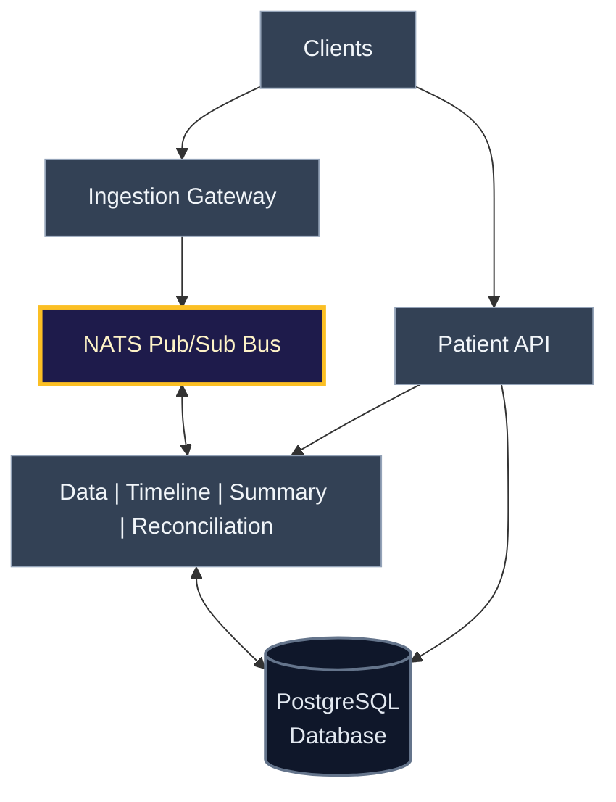

# Healthcare Processing Prototype

A microservices-based healthcare data processing system that demonstrates how to architect a scalable platform for ingesting patient data from multiple sources, resolving patient identity, reconciling conflicting data, and generating AI-driven risk assessments.

## Project Overview

This prototype mirrors the architecture and workflows used by value-based care AI platforms (such as Optum AI, Change Healthcare Analytics, and similar vendors) that help healthcare providers identify high-risk Medicare patients, coordinate care, and participate in value-based payment programs.

### Core Capabilities

- **Multi-Source Data Ingestion** — Consume patient events from Medicare claims, Hospital EHR systems, and Lab results
- **Identity Resolution** — Atomically resolve patient identity across sources using a shared anchor (Medicare ID) to prevent duplicate records
- **Event Reconciliation** — Apply business rules to merge conflicting data from multiple sources, with debounce windows to handle late-arriving events
- **Unified Patient Timeline** — Maintain a materialized view of each patient's latest reconciled state for rapid lookups
- **AI Risk Assessment** — Use LLMs to analyze patient timelines and generate risk tier recommendations (high/medium/low/critical)
- **Horizontal Scaling** — Stateless services with queue-based work distribution enable independent scaling of compute-intensive operations

The prototype emphasizes **correct scoping of microservices boundaries** to distribute load effectively. Each service has a single, well-defined responsibility and can scale based on its bottleneck (event parsing, identity coordination, reconciliation logic, or AI inference).

### Service Architecture

<div style="display: flex; justify-content: center;">



</div>

## Core Architecture Documentation

### [MVP Architecture](sdlc/plans/mvp-architecture.md)

Provides a high-level overview of all services and their responsibilities:

| Service | Responsibility |
|---------|-----------------|
| Ingestion Gateway | Raw event parsing and message ID assignment |
| Patient Data Service | Identity resolution and golden record |
| Patient Event Reconciliation | Debounce coordination, task publishing, and idempotency checking |
| Patient Reconciliation Worker | Rule-based event merging and reconciliation |
| Patient Timeline | Materialized view refresh and event storage |
| Patient Summary | LLM risk assessment and recommendations |
| Patient API | Read gateway and query orchestration |
| Notification Service | Alert routing and notification delivery |

### [MVP Data Schema](sdlc/plans/mvp-tables.md)

- `patient_data.*` — Identity resolution and golden record (demographics)
- `patient_event_reconciliation.*` — Event log, debounce state, pending work
- `patient_timeline.*` — Materialized view of latest per-patient state
- `patient_summary.*` — LLM-generated recommendations with risk tiers

---

## Running the Prototype

### Prerequisites
- Docker & Docker Compose
- Python 3.10+ (for client)
- uv (Python package manager)

### Startup
```bash
# Build all services
docker-compose build

# Start the stack
docker-compose up

# In another terminal, run the client
cd client
python main.py
```

### Client Commands
- `[pi]` — Fetch patient info (golden record)
- `[pr]` — Fetch patient recommendation (risk assessment)
- `[pt]` — Fetch patient timeline (latest reconciled state)
- `[m/b/l/h]` — Submit Medicare/Hospital/Lab/Hydrate events
- `[p]` — Pick a different patient
- `[q]` — Quit

### Testing
```bash
# Type-check patient summary service
python -m mypy services/patient-summary/patient_summary_service.py

# Run all tests (if added)
python -m pytest

# Check service health
curl http://localhost:8000/health  # Patient API
curl http://localhost:8222/jsz     # NATS metrics
```

### Observability

The prototype includes integrated observability across three dimensions:

- **Distributed Tracing**: OpenTelemetry with Jaeger (http://localhost:3030) — correlates requests across service boundaries. Trace context propagated through NATS messages.
- **Metrics**: Prometheus (http://localhost:3020) — tracks request latency, throughput, error rates by endpoint. Scraped from `/metrics` on each service.
- **Structured Logging**: JSON logs aggregated in Loki (http://localhost:3010) via Grafana — queryable logs with canonical_patient_id, task_id, action, and payloads for reconciliation events.

All three pipelines are enabled in docker-compose by default. Access dashboards via Grafana (http://localhost:3000, admin/admin).

---

## Architecture: Top 5 Scaling Decisions

| Decision | Why It Scales | Tradeoff | Impact |
|----------|---------------|----------|--------|
| **JetStream Streams for Durable Work Distribution** — Use NATS JetStream (durable streams with consumer groups) instead of core NATS fanout for critical paths | Consumer groups enable round-robin distribution; durable streams survive restarts; new instances auto-join safely | Adds operational complexity; slightly higher latency than in-memory fanout; requires consumer group understanding | Enables 10x+ instances of Patient Event Reconciliation and Reconciliation Worker without message duplication or loss |
| **Per-Patient Debounce with Postgres Row Locks** — Coordinate event debounce via Postgres `SELECT FOR UPDATE` on `pending_publish_debouncer` table | Fine-grained per-patient locking (not global); row locks are sub-millisecond; highly available; any instance can take over | Lock contention under extreme per-patient throughput; not suitable for multi-datacenter; debounce hold time must be short | Per-patient bottleneck negligible: 99% of events are for existing patients, only 0.5-1% are new registrations |
| **Materialized View for O(1) Timeline Lookup** — Store latest reconciled state in `timeline_events_latest`, refreshed via `DISTINCT ON(canonical_patient_id)` | Patient API fetches latest timeline in O(1); no pagination overhead for common case; instant lookups via indexes; decouples read latency from event volume | Refresh adds latency to reconciliation path; requires careful handling of concurrent updates; history in separate append-only table | Handles thousands of concurrent requests; providers request patient timeline in 50-100ms |
| **Stateless Service Instances with Independent Scaling** — All compute services stateless, scale horizontally; no shared state beyond message bus and database | Instances join/leave without rebalancing; no master election needed; failure isolation; auto-scale via Kubernetes KEDA | Requires careful idempotency handling; database becomes coordination point (bottleneck risk); no shared state for debugging | Reconciliation Worker scales from 1 (MVP) to 50+ (production) with no code changes |
| **Single Source of Truth for Identity (No Sharding)** — Patient identity mapping lives in single primary with read replicas, not sharded | Guarantees consistency; prevents silent data corruption; read replicas distribute SELECT queries without sacrificing write consistency | Single primary is write bottleneck; atomic upsert serializes concurrent registrations; not suitable for cross-region | Postgres write throughput 1000-2000 inserts/sec is negligible for 50-100 new patients/day; extreme scale (10k+/day) would require sharding |

---

## Key Learnings & Design Decisions

The prototype captures several critical architectural learnings documented in [sdlc/notes/learnings.md](sdlc/notes/learnings.md):

**Message Bus Semantics**: NATS core ≠ Kafka. Core NATS is stateless pub/sub; JetStream adds durability and consumer groups. Topic-based routing works for specific consumers; queue groups distribute work across stateless instances.

**Identity Resolution Cannot Be Sharded**: Per-source sharding (Medicare shard, Hospital shard, Labs shard) breaks identity resolution by creating multiple canonical IDs for the same patient. Solution: single primary + read replicas.

**Debounce Bottleneck is Per-Patient**: Row-level locks are acceptable because debounce hold times are milliseconds, and different patients don't contend. New patient registration is <1% of traffic in real systems.

**LLM Response Parsing Requires Fallback**: LLMs are non-deterministic. Always wrap JSON parsing in try-except with sensible defaults (return plain text as summary, default to "medium" risk tier).

**API Response Models Trim Internal Details**: Don't leak deduplication hashes or internal IDs to API consumers. Return only fields clients need.

**Data Model Drives API Design**: Pagination makes sense for multi-row queries. For materialized view (1 row per patient), pagination is pointless. Use separate endpoints: `/timeline` (latest) vs `/timeline-events` (history).

---

## Future Work

The prototype is a complete implementation of core functionality. Production systems require additional features documented in [sdlc/plans/mvp-future-enhancements.md](sdlc/plans/mvp-future-enhancements.md):

- **Conflict Detection & Resolution** — Expose when sources disagree on patient attributes; provide operator UI for manual resolution with audit trail
- **Event Versioning & Late Arrivals** — Support corrections (versioning, supersede logic), reprocess events arriving outside debounce window
- **Batch Risk Assessment** — Nightly cron job to backfill risk assessments for patients with stale recommendations
- **HIPAA Compliance & Audit** — Encryption at rest/in transit, role-based access control, immutable audit logging for regulatory review
- **Production Monitoring** — Metrics (reconciliation latency, queue depth, LLM accuracy), dead-letter queue for failures, cost optimization

---

## License

Learning project. Feel free to use for education and prototyping.
