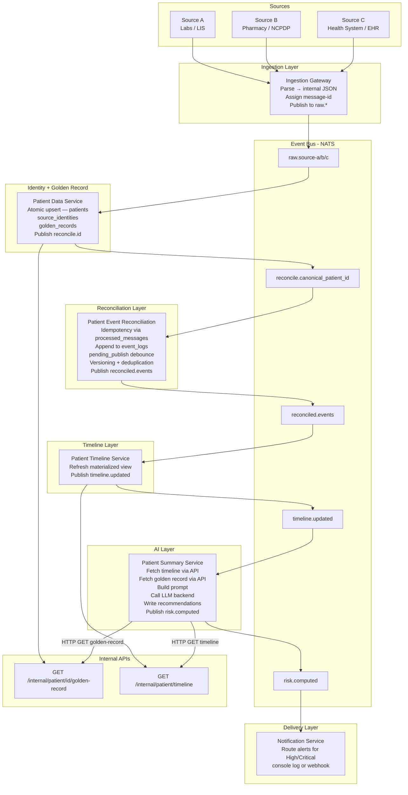

# MVP Architecture Plan — Healthcare Data Processing Platform

## Summary

This plan describes the architecture for a learning project modeled after Pearl Health's value-based care platform. The system ingests patient records from multiple independent sources, reconciles delayed and corrected records, constructs a longitudinal patient timeline, applies LLM-based risk assessment, and delivers alerts.

This is a hypothesis/learning project. No real patient data is used.

## Key Decisions

- Event-driven architecture using **NATS** as the message broker — see Section 1 for full rationale.
- Each service connects to NATS via a `MessageBus` wrapper around `nats-py`. The connection is established in the FastAPI lifespan. Services and data providers are instantiated at **module level** (outside lifespan) and registered in a singleton store. Lifespan only calls `connect()` and `drain()`.
- The bus interface (`publish` / `subscribe`) is kept intentionally narrow so the backing implementation can be swapped to NATS JetStream or Kafka without touching service logic.
- Internal data is stored as plain JSON in Postgres. No external data standards imposed.
- Idempotency is enforced via a stable `message-id` on every inbound event — see Section 2.
- **Patient Data Service** merges MPI identity resolution and golden record construction into a single service. It publishes to `reconcile.{canonical_patient_id}` after upsert — no synchronous HTTP call from reconciliation to resolve identity.
- Reconciliation is a first-class concern — handled by a dedicated service, not bolted onto ingestion.
- **Debounce is owned by Patient Event Reconciliation** — not Timeline. Reconciliation accumulates events into `event_logs`, manages a `pending_publish` debounce window, then publishes `reconciled.events` when the window expires.
- **Risk stratification is LLM-driven** — the LLM receives a patient summary and returns a structured risk assessment.
- LLM is inserted post-reconciliation so it always operates on the cleanest available timeline.
- **No UI in scope.** Backend services only.
- Service framework: **FastAPI (Python)**. Container runtime: **Docker Compose** — one container per service.
- Python package management: **uv** with **pyproject.toml**. Monorepo workspace layout — one `pyproject.toml` per service plus a shared internal library. Each service is independently deployable.

## Assumptions

- This is a learning project — service boundaries are illustrative rather than production-grade.
- A single Postgres instance with per-service schemas is acceptable.
- LLM backend is abstracted via an `AgenticHandler` / `LLMBackend` interface backed by dictionaries for the demo. Both can be swapped independently without changing service logic.
- Synthetic/mock data only — no real patient data.
- Three inbound data sources are modeled: **Source A (Labs / LIS)**, **Source B (Pharmacy / NCPDP)**, and **Source C (Health System / EHR)**. Each operates independently, on its own schedule, and uses its own patient identifiers.

## Risks and Dependencies

- Reconciliation logic is domain-specific and requires clear business rules before implementation.
- LLM-based risk assessment quality depends on prompt design — prompt templates must be versioned.
- The patient identity matching in Patient Data Service must be atomic to avoid race conditions when all three sources arrive in parallel.

---

## 1. Why a Message Bus

### Rationale

Source A (Labs), Source B (Pharmacy), and Source C (Health System) do not deliver data at the same time or at the same rate. Source A (Labs) may fire an event immediately when a result is ready. Source B (Pharmacy) may deliver dispensing records days or weeks later. Source C (Health System) pushes data on a scheduled EHR export. Each source operates independently.

A message bus decouples these producers from the services that need to react to them. Without a bus, every downstream service would need to be called directly by the ingestion layer — creating tight coupling that breaks when any service is slow, redeploying, or processing a correction.

**Chosen implementation: NATS** — a lightweight open-source message broker. Single Docker container,
no configuration file needed for basic pub/sub. Each service connects as an async client using
`nats-py`.

**Why NATS over Kafka for this POC:**
- Single container, no ZooKeeper or schema registry required
- Native async Python client (`nats-py`) matches the FastAPI async model exactly
- Simple enough that the compose file stays readable
- Already the listed production step-up path — same concepts apply at scale

**Connection pattern — module-level instantiation + FastAPI lifespan:**

Services and data providers are instantiated at **module level** (Python module import time, before
the NATS connection opens). Lifespan only calls `connect()` / `drain()`. Services are stored in a
singleton store for access by routers and message handlers:

```python
from contextlib import asynccontextmanager
from shared.message_bus import MessageBus
from shared.singleton_store import register_singleton, get_singleton, remove_singleton

bus = MessageBus(os.getenv("NATS_URL", ""))
data_provider = SomeDataProvider(reader_dsn=..., writer_dsn=...)
register_singleton(SomeService, SomeService(data_provider, bus))

async def _handle_event(msg):
    await get_singleton(SomeService).handle_event(msg)

@asynccontextmanager
async def lifespan(app: FastAPI):
    await bus.connect()
    await data_provider.connect()
    await bus.subscribe("some.topic", _handle_event)
    yield
    await bus.drain()
    remove_singleton(SomeService)
    await data_provider.disconnect()

app = FastAPI(lifespan=lifespan)
```

**Teardown order:** `drain → remove_singleton → disconnect`. Drain first to flush in-flight messages
before the service reference is removed and the DB pool closes.

**Publish:**
```python
await self.bus.publish("reconcile." + canonical_patient_id, payload)
```

**Subscribe:**
```python
async def handle_event(msg):
    data = json.loads(msg.data.decode())
    # process...
```

**Trade-offs accepted for POC:**
- No message persistence — NATS core (non-JetStream) does not store messages. If a service is
  down when a message is published, the message is lost. Patient Event Reconciliation mitigates
  this by persisting all events to `event_logs` on receipt — the durable append-only log acts as
  a NATS persistence substitute within the reconciliation window.
- No consumer groups / competing consumers — NATS core delivers to all subscribers. Horizontal
  scaling requires NATS JetStream (queue groups), deferred to production.

### What Flows as Messages

| Topic | What the message represents | Producer | Consumer(s) |
|---|---|---|---|
| `raw.source-a` | An event from Source A (Labs / LIS) | Ingestion Gateway | Patient Data Service |
| `raw.source-b` | An event from Source B (Pharmacy / NCPDP) | Ingestion Gateway | Patient Data Service |
| `raw.source-c` | An event from Source C (Health System / EHR) | Ingestion Gateway | Patient Data Service |
| `patient.hydrate` | Trigger to hydrate a patient record | Internal | Patient Data Service |
| `reconcile.{canonical_patient_id}` | A staged source event, ready for reconciliation — one subject per patient | Patient Data Service | Patient Event Reconciliation |
| `reconciled.events` | A validated, deduplicated, versioned patient event (after debounce settles) | Patient Event Reconciliation | Patient Timeline Service |
| `timeline.updated` | A patient's timeline has been refreshed | Patient Timeline Service | Patient Summary Service |
| `risk.computed` | A completed LLM risk assessment | Patient Summary Service | Notification Service |

Per-patient NATS subjects (`reconcile.{canonical_patient_id}`) ensure NATS delivers all events for
the same patient to the same subscriber in order. Patient Event Reconciliation subscribes with
the wildcard `reconcile.*` to receive all patients. This per-subject ordering guarantee is what
makes the debounce logic safe without cross-instance coordination.

### Internal Data Format

Each source's raw format is parsed at the Ingestion Gateway boundary and converted to simple internal JSON structs. Each service defines its own minimal schema. No shared canonical data model is imposed across services.

### Pipeline Style

**Kappa-style**: everything is a stream. Derived views (timeline, risk) are materialized from stream events. No separate batch ETL step.

---

## 2. Reconciliation and Idempotency

Records from all three sources are routinely:
- **Delayed** — Source B records may arrive long after the originating event.
- **Corrected** — sources may re-send updated versions of previously delivered records.
- **Duplicated** — the same real-world event may arrive from more than one source.

### Idempotency via Message IDs

Every message published to the broker carries a stable `message-id`. This is the primary idempotency mechanism across all services.

**How it works:**
1. The Ingestion Gateway assigns a `message-id` derived deterministically from the source record's own identifier: `sha256(source_id + version + source_system)`.
2. Before processing, Patient Event Reconciliation checks whether `message_id` already exists in `patient_event_reconciliation.processed_messages`.
3. If found: skip processing, acknowledge the message.
4. If new: process, record the `message_id`.

### Identity Resolution — Patient Data Service

Raw events arrive without a `canonical_patient_id`. The Patient Data Service resolves identity
on receipt of `raw.*` events:

1. Receives `raw.source-a/b/c` from Ingestion Gateway.
2. Upserts patient identity atomically in `patient_data.patients` and `patient_data.source_identities`.
3. Builds or updates the golden record in `patient_data.golden_records`.
4. Publishes `reconcile.{canonical_patient_id}` — the canonical ID is embedded in the subject.

Patient Event Reconciliation extracts `canonical_patient_id` directly from the NATS subject
(`reconcile.{canonical_patient_id}`) — no synchronous HTTP call to resolve identity.

### Additional Reconciliation Patterns

- **Versioned records** — corrected records are stored as a new version; queries always surface the latest non-voided version.
- **Tombstone events** — a cancellation is an explicit event that marks prior records inactive, not a deletion.
- **Late-arrival windows** — events arriving within N days of the event date are reconciled into the active window; older late arrivals trigger a reprocessing path.

---

## 3. Patient Data Service

The Patient Data Service answers: *"Is the patient in this incoming event the same person I have already seen from a different source, and what is the current merged view of that patient?"*

It replaces the former MPI service and extends it with golden record construction.

### The Problem

Source A, Source B, and Source C each assign their own internal patient identifiers. The same real-world patient will have three different IDs across three sources. Without resolution, downstream services would build three separate timelines for the same person. Additionally, downstream services (Patient Summary) need a single merged patient profile — the golden record — rather than pulling demographics from each source individually.

### Who Goes First — The Race Condition

All three sources may publish events in parallel. Whichever source event reaches the Patient Data Service first **creates** the canonical patient ID. All later arrivals for the same patient **match** to it. Order does not matter for correctness — what matters is that the lookup-or-create operation is **atomic**:

```sql
-- Attempt to insert; on conflict (shared anchor already exists), do nothing
INSERT INTO patient_data.patients (shared_identifier, canonical_patient_id)
VALUES ($shared_id, gen_random_uuid())
ON CONFLICT (shared_identifier) DO NOTHING;

-- Always fetch — returns existing record if conflict occurred
SELECT canonical_patient_id FROM patient_data.patients WHERE shared_identifier = $shared_id;
```

### The Shared Anchor

Matching requires at least one **shared data element** that all sources include — something stable that identifies the same real-world patient across systems. For this system, the shared anchor is a patient registration ID agreed upon across all sources (equivalent to a Medicare Beneficiary ID in the real world). Name + date of birth serves as a fallback when the shared ID is absent.

### Patient Data Model (Postgres — schema `patient_data`)

```sql
-- One row per unique patient
CREATE TABLE patient_data.patients (
  canonical_patient_id  UUID PRIMARY KEY DEFAULT gen_random_uuid(),
  shared_identifier     TEXT UNIQUE,
  created_at            TIMESTAMPTZ NOT NULL DEFAULT NOW()
);

-- Registry of inbound source systems
CREATE TABLE patient_data.source_systems (
  id                    BIGSERIAL PRIMARY KEY,
  source_system_name    TEXT UNIQUE NOT NULL,
  created_at            TIMESTAMPTZ NOT NULL DEFAULT NOW()
);

-- One row per (source, source_patient_id) pair seen
CREATE TABLE patient_data.source_identities (
  id                    BIGSERIAL PRIMARY KEY,
  canonical_patient_id  UUID NOT NULL REFERENCES patient_data.patients(canonical_patient_id),
  source_system_id      BIGINT NOT NULL REFERENCES patient_data.source_systems(id),
  source_patient_id     TEXT NOT NULL,
  first_name            TEXT,
  last_name             TEXT,
  date_of_birth         DATE,
  created_at            TIMESTAMPTZ NOT NULL DEFAULT NOW(),

  UNIQUE (source_system_id, source_patient_id)
);

-- Merged patient profile — updated on each source identity upsert
CREATE TABLE patient_data.golden_records (
  id                    BIGSERIAL PRIMARY KEY,
  canonical_patient_id  UUID NOT NULL REFERENCES patient_data.patients(canonical_patient_id),
  first_name            TEXT,
  last_name             TEXT,
  date_of_birth         DATE,
  source_system_ids     BIGINT[],  -- contributing source systems
  updated_at            TIMESTAMPTZ DEFAULT NOW(),
  created_at            TIMESTAMPTZ DEFAULT NOW()
);
```

All downstream services use only `canonical_patient_id`. Source-specific IDs are retained for provenance but never used for routing.

### Internal API

`GET /internal/patient/{canonical_patient_id}/golden-record` — returns the merged patient profile. Called by Patient Summary Service when building the LLM prompt.

---

## 4. Patient Timeline Construction

A patient timeline is a longitudinal, deduplicated, chronologically ordered sequence of events anchored to a single canonical patient ID.

### Construction Steps

1. Patient Data Service resolves `canonical_patient_id` and publishes `reconcile.{canonical_patient_id}`.
2. Patient Event Reconciliation receives the event, appends to `event_logs`, and upserts `pending_publish` to reset the debounce window.
3. When the debounce window expires, Patient Event Reconciliation applies versioning, deduplication, and void handling across the `event_logs` window, writes the merged result to `resolved_events`, and publishes `reconciled.events`.
4. Patient Timeline Service receives `reconciled.events`, calls `REFRESH MATERIALIZED VIEW CONCURRENTLY patient_timeline`, and publishes `timeline.updated` after the refresh completes (refresh-then-publish).
5. Patient Summary Service receives `timeline.updated`, fetches the patient's timeline via the Patient Timeline internal API, fetches the golden record via the Patient Data internal API, and runs LLM assessment.

### Refresh-Then-Publish Ordering Rule

Patient Timeline must **call `REFRESH MATERIALIZED VIEW CONCURRENTLY` before publishing `timeline.updated`**. If the order is reversed and the service crashes between publish and refresh, Patient Summary is triggered but reads stale data.

If Patient Timeline crashes after refreshing but before publishing, `timeline.updated` is simply not emitted. The materialized view in Postgres retains the last successfully refreshed state. Patient Summary reads stale but correct data until the next `timeline.updated`. The cron safety net catches this.

**Note:** `REFRESH MATERIALIZED VIEW CONCURRENTLY` requires a unique index on the view and refreshes the entire view, not per-patient. For the POC with synthetic data this is acceptable.

### Patient Timeline Schema (Postgres — schema `patient_timeline`)

```sql
CREATE TABLE patient_timeline.timeline_events (
  id                    BIGSERIAL PRIMARY KEY,
  canonical_patient_id  UUID NOT NULL,
  event_type            TEXT,
  payload               JSONB,
  occurred_at           TIMESTAMPTZ,
  source_system_id      BIGINT,  -- plain value, no FK (cross-schema)
  created_at            TIMESTAMPTZ DEFAULT NOW()
);

-- Materialized view — refreshed by Patient Timeline Service on each reconciled.events
CREATE MATERIALIZED VIEW patient_timeline.patient_timeline AS
  SELECT canonical_patient_id, ...
  FROM patient_timeline.timeline_events
  ORDER BY occurred_at;

-- Required for CONCURRENT refresh
CREATE UNIQUE INDEX patient_timeline_unique_idx ON patient_timeline.patient_timeline (id);
```

### Internal API

`GET /internal/patient/timeline?canonical_patient_id=&page=&page_size=` — returns paginated timeline. Called by Patient Summary Service.

---

## 5. Patient Event Reconciliation — Debounce and Event Log

### Why Debounce Lives Here

Raw events from multiple sources arrive in rapid succession (e.g. a Source C nightly batch export sends dozens of records for the same patient). Running the full reconciliation pipeline — and triggering an LLM assessment — on every individual event would be wasteful. Only the final settled state matters.

Patient Event Reconciliation owns the debounce. It accumulates events into an append-only `event_logs` table, maintains a `pending_publish` row per patient to track the debounce window, and publishes `reconciled.events` only once the window expires.

`event_logs` also serves as a **NATS persistence substitute** — because NATS core does not store messages, events are written to `event_logs` on receipt so they can be processed even if the reconciliation worker restarts mid-window.

### Debounce Schema (Postgres — schema `patient_event_reconciliation`)

```sql
-- Durable log of all staged events (NATS persistence substitute)
CREATE TABLE patient_event_reconciliation.event_logs (
  id                    BIGSERIAL PRIMARY KEY,
  canonical_patient_id  UUID NOT NULL,
  source_system_id      BIGINT NOT NULL,  -- plain value, no FK (cross-schema)
  message_id            TEXT NOT NULL,
  event_type            TEXT NOT NULL,
  payload               JSONB NOT NULL,
  occurred_at           TIMESTAMPTZ,
  created_at            TIMESTAMPTZ DEFAULT NOW()
);

-- One active row per patient during a debounce window
CREATE TABLE patient_event_reconciliation.pending_publish (
  id                    BIGSERIAL PRIMARY KEY,
  canonical_patient_id  UUID NOT NULL,
  last_event_log_id     BIGINT NOT NULL REFERENCES event_logs(id),
  scheduled_after       TIMESTAMPTZ NOT NULL,  -- resets on each new event (debounce)
  ceiling_at            TIMESTAMPTZ NOT NULL,  -- hard deadline — never moves forward
  published_at          TIMESTAMPTZ,           -- NULL = active window; NOT NULL = closed
  updated_at            TIMESTAMPTZ DEFAULT NOW()
);

-- Fast lookup for active windows only
CREATE INDEX pending_publish_active_idx
  ON pending_publish (canonical_patient_id, last_event_log_id)
  WHERE published_at IS NULL;

-- Final merged output per debounce window
CREATE TABLE patient_event_reconciliation.resolved_events (
  id                    BIGSERIAL PRIMARY KEY,
  canonical_patient_id  UUID NOT NULL,
  source_system_ids     BIGINT[],
  from_event_log_id     BIGINT NOT NULL REFERENCES event_logs(id),
  to_event_log_id       BIGINT NOT NULL REFERENCES event_logs(id),
  payload               JSONB NOT NULL,
  resolution_log        TEXT,  -- why the payload was resolved as it was
  occurred_at           TIMESTAMPTZ,
  created_at            TIMESTAMPTZ DEFAULT NOW()
);

-- Conflict records for audit and manual review
CREATE TABLE patient_event_reconciliation.reconciliation_conflicts (
  id                    BIGSERIAL PRIMARY KEY,
  canonical_patient_id  UUID NOT NULL,
  source_system_ids     BIGINT[],
  conflict_type         TEXT,
  details               JSONB,
  created_at            TIMESTAMPTZ DEFAULT NOW()
);

-- Idempotency table
CREATE TABLE patient_event_reconciliation.processed_messages (
  message_id            TEXT PRIMARY KEY,
  processed_at          TIMESTAMPTZ DEFAULT NOW()
);
```

### Debounce Rules

| Condition | Action |
|---|---|
| New event arrives, no active window | Insert `pending_publish` with `scheduled_after = NOW() + window`, `ceiling_at = NOW() + hard_deadline` |
| New event arrives, active window exists, `scheduled_after` not yet expired | Update `scheduled_after = NOW() + window` (reset debounce); `ceiling_at` never moves |
| New event arrives after `ceiling_at` (past hard deadline) | `published_at IS NULL` but expired at ceiling — treat as settled; reconcile and publish |
| Debounce window expires (`scheduled_after ≤ NOW()`) | Reconcile `event_logs` for this window; write `resolved_events`; publish `reconciled.events`; set `published_at = NOW()` |

Rows with `published_at IS NOT NULL` are historical records kept for auditing. The partial index
on `WHERE published_at IS NULL` ensures active-window lookups remain fast regardless of
historical row accumulation.

### Internal API

`GET /internal/patient/{canonical_patient_id}/conflicts` — returns paginated conflict records.

---

## 6. Risk Stratification — LLM-Driven

Risk is assessed after the timeline is materialized. There is no separate rule-based engine.

### Two Assessment Paths

Patient Summary Service runs assessment via two triggers:

| Mode | Trigger |
|---|---|
| **Event-driven** | Receives `timeline.updated` from Patient Timeline Service |
| **Nightly batch** | Cron entry point — assesses patients with no recent recommendation |

Both paths execute the same `_assess_patient()` logic:
1. `GET {timeline_url}/internal/patient/timeline?canonical_patient_id={id}` — fetch materialized timeline from Patient Timeline Service.
2. `GET {patient_data_url}/internal/patient/{id}/golden-record` — fetch merged patient demographics from Patient Data Service.
3. Build versioned prompt from timeline events + golden record demographics.
4. Call `AgenticHandler.complete(prompt, context)` — block until LLM result is returned.
5. Deduplication check: hash check → structural diff → cosine similarity tiebreaker.
6. Persist result to `patient_summary.recommendations`.
7. Publish `risk.computed` to the message bus.

### LLM Risk Assessment Format

```json
{
  "risk_tier": "High",
  "key_risks": ["multiple recent events", "no follow-up recorded", "escalating pattern"],
  "recommended_actions": ["schedule follow-up within 7 days", "review current care plan"],
  "summary": "Patient presents elevated risk based on recent event pattern...",
  "generated_at": "2026-03-22T18:00:00Z",
  "model": "claude-sonnet-4-6",
  "prompt_version": "v1"
}
```

### Guardrails

- Output stored with prompt version and model version for auditability.
- Always labeled AI-generated — not a clinical decision.
- Only synthetic data sent to the LLM provider.

---

## 7. LLM Integration

The Patient Summary Service performs both risk stratification and plain-language summary generation.
It is designed as an **agent loop** — capable of multi-step reasoning, tool use, and RAG-style
retrieval to confirm and enhance recommendations. For the demo, the LLM backend is abstracted
behind an adapter interface so it can be swapped without changing service logic.

### Adapter Interface

```
LLMBackend.complete(prompt: str, context: dict) -> AsyncIterator[str]
```

**Demo implementation:** returns responses from a static dictionary keyed by risk scenario.

**Future entry points (not in scope for MVP):**
- Ollama (local model, same interface)
- LangGraph (stateful agent loop with tool use and RAG)
- Anthropic Claude API (direct)

### Recommendation Deduplication

| Method | Compares | Cost | When applied |
|---|---|---|---|
| SHA-256 hash | Full output, exact | Free | Always — first check |
| Structural diff | `risk_tier` + `key_risks` set intersection | Free | Hash differs |
| Cosine similarity (pgvector) | Embedding of `summary` free-text | Medium | Structural diff inconclusive |

**Default for MVP demo:** hash check only.

### Patient Summary Schema (Postgres — schema `patient_summary`)

```sql
CREATE TABLE patient_summary.recommendations (
  id                    BIGSERIAL PRIMARY KEY,
  canonical_patient_id  UUID NOT NULL,
  risk_tier             TEXT,
  key_risks             JSONB,
  recommended_actions   JSONB,
  summary               TEXT,
  model                 TEXT,
  prompt_version        TEXT,
  mode                  TEXT,  -- 'batch' or 'event'
  has_changed_from_last BOOLEAN,
  similarity_score      FLOAT,
  generated_at          TIMESTAMPTZ DEFAULT NOW()
);
```

---

## 8. Microservices Topology

### Services

| Service | Responsibility | Port |
|---|---|---|
| Ingestion Gateway | Accepts raw events from Source A, B, C. Parses to internal JSON. Assigns `message-id`. Publishes to `raw.*` topics via `MessageBus`. **FastAPI + Docker.** | 8001 |
| Patient Data Service | Resolves patient identity atomically across sources. Upserts `patients`, `source_identities`, `golden_records`. Publishes to `reconcile.{canonical_patient_id}`. Exposes `/internal/patient/{id}/golden-record`. | 8002 |
| Patient Event Reconciliation | Consumes `reconcile.*`. Enforces idempotency via `processed_messages`. Appends to `event_logs`. Manages `pending_publish` debounce window. On window expiry: applies versioning, deduplication, void handling; writes `resolved_events`; publishes `reconciled.events`. Exposes `/internal/patient/{id}/conflicts`. | 8003 |
| Patient Timeline Service | Consumes `reconciled.events`. Calls `REFRESH MATERIALIZED VIEW CONCURRENTLY patient_timeline`. Publishes `timeline.updated` after refresh completes. Exposes `/internal/patient/timeline`. | 8004 |
| Patient Summary Service | Subscribes to `timeline.updated`. Fetches timeline via Patient Timeline API and golden record via Patient Data API. Builds versioned prompt. Calls LLM backend. Applies deduplication. Writes to `recommendations`. Publishes `risk.computed`. Cron batch runs nightly. | 8005 |
| Notification Service | Consumes `risk.computed`. Routes alerts for High/Critical risk patients (console log in POC). | 8006 |
| Patient API Service | Exposes HTTP endpoints for external consumers. Delegates to downstream services via `PatientServiceCoordinator`. Does not own any DB tables. | 8000 |

### Event Bus Topics

| Topic | Producer | Consumer(s) | Why |
|---|---|---|---|
| `raw.source-a` | Ingestion Gateway | Patient Data Service | Register patient; record Source A event |
| `raw.source-b` | Ingestion Gateway | Patient Data Service | Register patient; version Source B record |
| `raw.source-c` | Ingestion Gateway | Patient Data Service | Register patient; merge Source C record |
| `patient.hydrate` | Internal | Patient Data Service | Hydrate patient record on demand |
| `reconcile.{canonical_patient_id}` | Patient Data Service | Patient Event Reconciliation | Stage event for reconciliation — per-patient ordering guaranteed by NATS subject |
| `reconciled.events` | Patient Event Reconciliation | Patient Timeline Service | Trigger timeline rebuild after debounce settles |
| `timeline.updated` | Patient Timeline Service | Patient Summary Service | Trigger risk assessment for this patient |
| `risk.computed` | Patient Summary Service | Notification Service | Route alerts based on risk tier |

---

## 9. Full Data Flow Diagram



---

## 10. Implementation Plan

### Phase 1: Foundation

1. Implement the `MessageBus` module (`/shared/message_bus.py`). Stable `publish` / `subscribe` interface backed by `nats-py`. `MessageBus` is instantiated at module level; `ValueError` on empty URL is deferred to `connect()`.
2. Implement the `singleton_store` module (`/shared/singleton_store.py`). `register_singleton` / `get_singleton` / `remove_singleton`.
3. Define internal JSON schemas for each event type (source event, reconciled event, timeline record, risk assessment). Store in `/schemas`.
4. Implement the Ingestion Gateway (FastAPI). Parses Source A, B, C. Assigns deterministic `message-id`. Publishes to `raw.*` via `MessageBus`.
5. Implement the Patient Data Service. Atomic lookup-or-create on shared anchor. Upserts `source_identities` and `golden_records`. Publishes to `reconcile.{canonical_patient_id}`. Exposes golden-record internal API.

### Phase 2: Reconciliation and Timeline

6. Implement Patient Event Reconciliation. Consume `reconcile.*`. Idempotency check. Append `event_logs`. Upsert `pending_publish` debounce window. On expiry: merge, write `resolved_events`, publish `reconciled.events`.
7. Implement Patient Timeline Service. Consume `reconciled.events`. Refresh materialized view. Publish `timeline.updated`. Expose timeline internal API.

### Phase 3: LLM Risk and Summary

8. Implement Patient Summary Service. Subscribe to `timeline.updated`. Fetch timeline + golden record via HTTP. Build versioned prompt. Call `LLMBackend` asynchronously (demo: static dictionary). Apply hash deduplication. Write to `recommendations`. Publish `risk.computed`. Implement cron batch for nightly run.

### Phase 4: Notification, API, and Observability

9. Implement Notification Service. Consume `risk.computed`. Log alerts for High/Critical patients.
10. Implement Patient API Service. FastAPI service with `PatientServiceCoordinator` delegating to downstream internal APIs.
11. Add structured logging with `correlation-id` (derived from `message-id`) across all services.
12. Write synthetic data generators for Source A, B, and C. Include delayed records, corrections, and duplicates.

---

## 11. Patient API Service

The Patient API Service exposes read and write endpoints for external consumers (UI, CLI, testing).
It does not own any database tables — it delegates to downstream services via `PatientServiceCoordinator`.

### Endpoints

#### GET /v1/patient/{canonical_patient_id}/info

Returns patient identity and golden record from Patient Data Service.

- **Source:** Patient Data Service → `patient_data.patients` + `patient_data.source_identities` + `patient_data.golden_records`
- **Response:** `canonical_patient_id`, `shared_identifier`, `created_at`, golden record demographics, list of source identities

---

#### GET /v1/patient/{canonical_patient_id}/timelines

Returns the patient's chronological event timeline, paginated.

- **Source:** Patient Timeline Service → `patient_timeline.patient_timeline` materialized view
- **Query params:** `page` (default 1), `pageSize` (default 10)
- **Response:** `canonical_patient_id`, `total_events`, `page`, `pageSize`, `events[]`

---

#### GET /v1/patient/{canonical_patient_id}/recommendation

Returns the most recent recommendation for the patient.

- **Source:** Patient Summary Service → `patient_summary.recommendations ORDER BY generated_at DESC LIMIT 1`
- **Response:** full recommendation record

---

#### GET /v1/patient/{canonical_patient_id}/recommendations

Returns paginated recommendation history for the patient.

- **Source:** Patient Summary Service → `patient_summary.recommendations ORDER BY generated_at DESC`
- **Query params:** `page` (default 1), `pageSize` (default 10)

---

#### GET /v1/patient/{canonical_patient_id}/conflicts

Returns paginated reconciliation conflicts for the patient.

- **Source:** Patient Event Reconciliation → `patient_event_reconciliation.reconciliation_conflicts ORDER BY created_at DESC`

---

#### POST /v1/patient/recommendations

Triggers an immediate single-patient assessment outside the nightly batch.

- **Request body:** `{ "opType": "refresh", "patientId": "<canonical_patient_id>" }`
- **Behaviour:** Patient API calls Patient Summary Service. Patient Summary runs `_assess_patient()` immediately (same logic as event-driven path).
- **Response:** `{ "queued": true, "canonical_patient_id": "..." }`

---

### Call Map

| Endpoint | Downstream service | Internal endpoint |
|---|---|---|
| `GET /info` | Patient Data | `GET /internal/patient/{id}/golden-record` |
| `GET /timelines` | Patient Timeline | `GET /internal/patient/timeline` |
| `GET /recommendation` | Patient Summary | `GET /internal/patient/{id}/recommendation` |
| `GET /recommendations` | Patient Summary | `GET /internal/patient/{id}/recommendations` |
| `GET /conflicts` | Patient Event Reconciliation | `GET /internal/patient/{id}/conflicts` |
| `POST /recommendations` | Patient Summary | `POST /internal/patient/recommendations` |

---

## Appendix: Python Dependencies

### Core Libraries (per service)

| Package | Version constraint | Purpose |
|---|---|---|
| `fastapi` | `>=0.111` | HTTP framework and dependency injection |
| `uvicorn[standard]` | `>=0.29` | ASGI server |
| `nats-py` | `>=2.7` | Async NATS client — publish / subscribe / drain |
| `asyncpg` | `>=0.29` | Async Postgres driver; used directly for raw SQL |
| `pydantic` | `>=2.6` | Request/response validation |
| `httpx` | `>=0.27` | Async HTTP client — inter-service API calls |

### Package Management

| Tool | Role |
|---|---|
| `uv` | Fast resolver and virtual-env manager; replaces `pip` + `pip-tools`. Each service has its own `pyproject.toml`; the repo root holds the workspace definition. |
| `pyproject.toml` | Declares `[project]` metadata and `[project.dependencies]` per service. Dev extras (`[project.optional-dependencies] dev = [...]`) hold test and lint tools. |

### `pyproject.toml` (single file at repo root)

One `pyproject.toml` at the monorepo root covers all services.

```toml
[project]
name = "learning-healthcare-processing"
version = "0.1.0"
requires-python = ">=3.12"
dependencies = [
    "fastapi>=0.111",
    "uvicorn[standard]>=0.29",
    "nats-py>=2.7",
    "asyncpg>=0.29",
    "pydantic>=2.6",
    "httpx>=0.27",
]

[project.optional-dependencies]
dev = ["pytest", "pytest-asyncio", "httpx", "ruff", "mypy"]
```

### No ORM — asyncpg directly

All DB access uses raw `asyncpg` queries. No ORM is introduced. Each data provider owns its own schema and query set. Cross-service data access goes through internal HTTP APIs — never direct cross-schema DB queries in production (single-instance Postgres used for the POC only).
