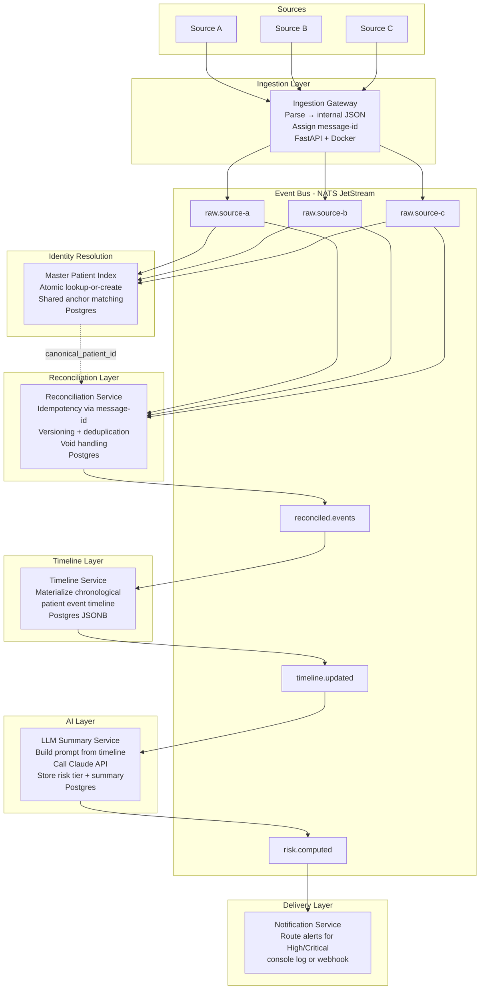

# MVP Architecture Plan — Healthcare Data Processing Platform

## Summary

This plan describes the architecture for a learning project modeled after Pearl Health's value-based care platform. The system ingests patient records from multiple independent sources, reconciles delayed and corrected records, constructs a longitudinal patient timeline, applies LLM-based risk assessment, and delivers alerts.

This is a hypothesis/learning project. No real patient data is used.

## Key Decisions

- Event-driven architecture using a message broker (NATS JetStream) as the backbone — see Section 1 for full rationale.
- Internal data is stored as plain JSON in Postgres. No external data standards imposed.
- Idempotency is enforced via a stable `message-id` header on every inbound event — see Section 2.
- Reconciliation Service resolves `canonical_patient_id` from MPI via synchronous HTTP with **exponential backoff retry** — see Section 2. Production path: publish an `identity.resolved` topic from MPI instead.
- Reconciliation is a first-class concern — handled by a dedicated service, not bolted onto ingestion.
- **Risk stratification is LLM-driven** — the LLM receives a patient summary and returns a structured risk assessment.
- LLM is inserted post-reconciliation so it always operates on the cleanest available timeline.
- **No UI in scope.** Backend services only.
- Service framework: **FastAPI (Python)**. Container runtime: **Docker Compose**.

## Assumptions

- This is a learning project — service boundaries are illustrative rather than production-grade.
- A single Postgres instance with per-service schemas is acceptable.
- LLM calls are made to Anthropic Claude via API. Synthetic/mock data only — no real patient data.
- Three inbound data sources are modeled: **Source A**, **Source B**, and **Source C**. Each operates independently, on its own schedule, and uses its own patient identifiers.

## Risks and Dependencies

- Reconciliation logic is domain-specific and requires clear business rules before implementation.
- LLM-based risk assessment quality depends on prompt design — prompt templates must be versioned.
- The MPI matching logic must be atomic to avoid race conditions when all three sources arrive in parallel.

---

## 1. Why a Message Broker

### Rationale

Source A, Source B, and Source C do not deliver data at the same time or at the same rate. Source A may fire an event immediately when something happens. Source B may deliver records days or weeks later. Source C pushes data on a scheduled export. Each source operates independently.

A message broker decouples these producers from the services that need to react to them. Without a broker, every downstream service would need to be called directly by the ingestion layer — creating tight coupling that breaks when any service is slow, redeploying, or processing a correction.

The broker also provides **replay**: if a bug is found in the Reconciliation Service and it is redeployed, it can re-consume all past events from the broker without the original sources re-sending anything.

**Chosen broker: NATS JetStream** — persistent, lightweight, single Docker container, sufficient for this MVP. Production equivalent is Apache Kafka.

### What Flows as Messages

| Topic | What the message represents | Producer | Why consumed |
|---|---|---|---|
| `raw.source-a` | An event from Source A | Ingestion Gateway | MPI registers the patient; Reconciliation records the event |
| `raw.source-b` | An event from Source B | Ingestion Gateway | MPI registers the patient; Reconciliation versions the record |
| `raw.source-c` | An event from Source C | Ingestion Gateway | MPI registers the patient; Reconciliation merges the record |
| `reconciled.events` | A validated, deduplicated, versioned patient event | Reconciliation Service | Timeline Service updates the patient timeline |
| `timeline.updated` | A patient's timeline has changed | Timeline Service | LLM Summary Service recomputes risk and summary |
| `risk.computed` | A completed LLM risk assessment | LLM Summary Service | Notification Service routes alerts |

### Internal Data Format

Each source's raw format is parsed at the Ingestion Gateway boundary and converted to simple internal JSON structs. Each service defines its own minimal schema. No shared canonical data model is imposed across services.

### Pipeline Style

**Kappa-style**: everything is a stream. Derived views (timeline, risk) are materialized from stream events. No separate batch ETL step.

---

## 2. Reconciliation and Idempotency

Records from all three sources are routinely:
- **Delayed** — Source B records may arrive long after the originating event.
- **Corrected** — sources may re-send updated versions of previously delivered records.
- **Duplicated** — the same real-world event may arrive from more than one source.

### Idempotency via Header IDs

Every message published to the broker carries a stable `message-id` header. This is the primary idempotency mechanism across all services.

**How it works:**
1. The Ingestion Gateway assigns a `message-id` derived deterministically from the source record's own identifier: `sha256(source_id + version + source_system)`.
2. Before processing, each service checks whether `message-id` already exists in its local idempotency table.
3. If found: skip processing, acknowledge the message, return the previously stored result.
4. If new: process, store the result, record the `message-id`.

Any service can safely re-consume a topic from the beginning without producing duplicate records.

**Idempotency table (per service, in Postgres):**
```sql
CREATE TABLE processed_messages (
  message_id   TEXT PRIMARY KEY,
  processed_at TIMESTAMPTZ NOT NULL DEFAULT NOW(),
  result_ref   TEXT  -- optional pointer to the resulting record
);
```

### MPI Lookup — Exponential Backoff Retry

The Reconciliation Service and MPI Service both consume raw topics simultaneously. Reconciliation may call MPI's HTTP endpoint before MPI has completed its upsert — a narrow but real race condition.

**Resolution: exponential backoff retry on the MPI lookup.**

```
attempt 1 → immediate
attempt 2 → wait 100ms
attempt 3 → wait 200ms
attempt 4 → wait 400ms
attempt 5 → wait 800ms → if still no result, route to dead-letter queue
```

Exponential backoff (vs fixed interval) avoids hammering MPI under load and respects any downstream rate limits. In practice on a local Docker network, MPI's upsert completes in microseconds — the race resolves on attempt 1 or 2 nearly always.

**Production path:** MPI publishes an `identity.resolved` event (with `canonical_patient_id`) after its upsert. Reconciliation subscribes to `identity.resolved` instead of calling MPI over HTTP. This eliminates the race class entirely and removes the synchronous HTTP dependency.

### Additional Reconciliation Patterns

- **Versioned records** — corrected records are stored as a new version; queries always surface the latest non-voided version.
- **Tombstone events** — a cancellation is an explicit event that marks prior records inactive, not a deletion.
- **Late-arrival windows** — events arriving within N days of the event date are reconciled into the active window; older late arrivals trigger a reprocessing path.

---

## 3. Master Patient Index (MPI)

The MPI answers one question: *"Is the patient in this incoming event the same person I have already seen from a different source?"*

### The Problem

Source A, Source B, and Source C each assign their own internal patient identifiers. The same real-world patient will have three different IDs across three sources. Without resolution, downstream services would build three separate timelines for the same person.

### Who Goes First — The Race Condition

All three sources may publish events in parallel. Whichever source event reaches the MPI first **creates** the canonical patient ID. All later arrivals for the same patient **match** to it. Order does not matter for correctness — what matters is that the lookup-or-create operation is **atomic**.

If two events arrive simultaneously and both find no existing record, they could each try to create a new canonical ID — producing two records for the same person. This is prevented with a single atomic database upsert:

```sql
-- Attempt to insert; on conflict (shared anchor already exists), do nothing
INSERT INTO mpi_patients (shared_anchor, canonical_patient_id)
VALUES ($shared_id, gen_random_uuid())
ON CONFLICT (shared_anchor) DO NOTHING;

-- Always fetch — returns existing record if conflict occurred
SELECT canonical_patient_id FROM mpi_patients WHERE shared_anchor = $shared_id;
```

### The Shared Anchor

Matching requires at least one **shared data element** that all sources include — something stable that identifies the same real-world patient across systems. Without a shared field, three parallel arrivals look like three different people.

For this system, the shared anchor is a patient registration ID agreed upon across all sources (equivalent to a Medicare Beneficiary ID in the real world). Name + date of birth serves as a fallback when the shared ID is absent.

### MPI Data Model (Postgres)

```sql
-- One row per unique patient
CREATE TABLE mpi_patients (
  canonical_patient_id  UUID PRIMARY KEY DEFAULT gen_random_uuid(),
  shared_anchor         TEXT UNIQUE,  -- the cross-source identifier used for matching
  created_at            TIMESTAMPTZ NOT NULL DEFAULT NOW()
);

-- One row per (source, source_id) pair seen
CREATE TABLE mpi_source_identities (
  id                    BIGSERIAL PRIMARY KEY,
  canonical_patient_id  UUID NOT NULL REFERENCES mpi_patients(canonical_patient_id),
  source_system         TEXT NOT NULL,   -- 'source-a' | 'source-b' | 'source-c'
  source_id             TEXT NOT NULL,   -- the ID that source assigned to this patient
  first_name            TEXT,
  last_name             TEXT,
  date_of_birth         DATE,
  created_at            TIMESTAMPTZ NOT NULL DEFAULT NOW(),

  UNIQUE (source_system, source_id)  -- one canonical ID per source record, enforced
);

CREATE INDEX idx_mpi_source    ON mpi_source_identities(source_system, source_id);
CREATE INDEX idx_mpi_name_dob  ON mpi_source_identities(last_name, date_of_birth);
CREATE INDEX idx_mpi_canonical ON mpi_source_identities(canonical_patient_id);
```

All downstream services (Reconciliation, Timeline, LLM) use only `canonical_patient_id`. Source-specific IDs are retained for provenance but never used for routing.

---

## 4. Patient Timeline Construction

A patient timeline is a longitudinal, deduplicated, chronologically ordered sequence of events anchored to a single canonical patient ID.

### Construction Steps

1. Reconciliation Service resolves `canonical_patient_id` via MPI before processing any event.
2. Deduplication — if two sources report the same real-world event, select the authoritative source and discard the duplicate.
3. Apply versioning — replace corrected versions, suppress voided events.
4. Timeline Service materializes the sorted event list into Postgres JSONB per patient.
5. Re-materializes whenever a new `reconciled.events` message arrives for that patient.

### Key Design Properties

- The timeline is a **derived view**, not a source of truth. The event log is the source of truth.
- Each event carries provenance: source system, ingested-at timestamp, version number.
- Stored as a Postgres JSONB column — simple to query, no additional infrastructure.

---

## 5. Risk Stratification — LLM-Driven

Risk is assessed after the timeline is materialized. There is no separate rule-based engine.

### LLM Risk Assessment Pattern

The LLM Summary Service builds a prompt from:
1. The patient's recent timeline events (configurable window, e.g. last 90–365 days).
2. Patient demographics (age, known conditions from timeline).
3. A versioned task instruction: *"Based on this patient's history, assign a risk tier (Low / Medium / High / Critical), list the top 3 risk factors, and recommend 2–3 care actions."*

The response is stored as structured JSON:

```json
{
  "risk_tier": "High",
  "key_risks": ["multiple recent events", "no follow-up recorded", "escalating pattern"],
  "recommended_actions": ["schedule follow-up within 7 days", "review current care plan"],
  "summary": "Patient presents elevated risk based on recent event pattern...",
  "generated_at": "2026-03-22T18:00:00Z",
  "model": "claude-sonnet-4-6",
  "prompt_version": "v1"
}
```

### Guardrails

- Output stored with prompt version and model version for auditability.
- Always labeled AI-generated — not a clinical decision.
- Only synthetic data sent to the LLM provider.

---

## 6. LLM Integration

The LLM Summary Service performs both risk stratification and plain-language summary generation in a single call. No separate risk engine service.

The service:
1. Subscribes to `timeline.updated`.
2. Fetches the patient's materialized timeline from Postgres.
3. Constructs a versioned prompt.
4. Calls the Anthropic Claude API.
5. Parses and validates the structured JSON response.
6. Stores the result in Postgres with full provenance.
7. Publishes `risk.computed` for the Notification Service.

The LLM is never in the ingestion or reconciliation path — it only reads finalized, deduplicated data.

---

## 7. Microservices Topology

### Services

| Service | Responsibility |
|---|---|
| Ingestion Gateway | Accepts raw events from Source A, B, C. Parses to internal JSON. Assigns `message-id`. Publishes to raw topics. **FastAPI + Docker.** |
| Master Patient Index (MPI) | Resolves patient identity across sources atomically. Assigns and stores canonical patient IDs. Postgres-backed. |
| Reconciliation Service | Consumes raw topics. Enforces idempotency via `message-id`. Applies versioning, deduplication, late-arrival, and void handling. Publishes `reconciled.events`. |
| Timeline Service | Consumes `reconciled.events`. Builds and maintains the materialized patient timeline in Postgres JSONB. Publishes `timeline.updated`. |
| LLM Summary Service | Consumes `timeline.updated`. Fetches timeline. Builds prompt, calls Claude API, stores structured risk + summary. Publishes `risk.computed`. |
| Notification Service | Consumes `risk.computed`. Routes alerts for High/Critical risk patients (console log or webhook). |

### Event Bus Topics

| Topic | Producer | Consumer(s) | Why |
|---|---|---|---|
| `raw.source-a` | Ingestion Gateway | MPI, Reconciliation Service | Register patient; record Source A event |
| `raw.source-b` | Ingestion Gateway | MPI, Reconciliation Service | Register patient; version Source B record |
| `raw.source-c` | Ingestion Gateway | MPI, Reconciliation Service | Register patient; merge Source C record |
| `reconciled.events` | Reconciliation Service | Timeline Service | Trigger timeline rebuild for the affected patient |
| `timeline.updated` | Timeline Service | LLM Summary Service | Trigger risk assessment and summary regeneration |
| `risk.computed` | LLM Summary Service | Notification Service | Route alerts based on risk tier |

---

## 8. Full Data Flow Diagram



---

## 9. Implementation Plan

### Phase 1: Foundation

1. Stand up NATS JetStream via Docker Compose. Configure the six topics in Section 7.
2. Define internal JSON schemas for each event type (source event, reconciled event, timeline record, risk assessment). Store in `/schemas`.
3. Implement the Ingestion Gateway (FastAPI). Three adapters for Source A, B, C. Each assigns a deterministic `message-id` and publishes to the appropriate raw topic.
4. Implement the MPI service. Atomic lookup-or-create on shared anchor. Fallback to name + DOB. Postgres-backed.

### Phase 2: Reconciliation and Timeline

5. Implement the Reconciliation Service. Consume raw topics. Check `message-id` idempotency table. Handle versioned and voided records. Publish to `reconciled.events`.
6. Implement the Timeline Service. Consume `reconciled.events`. Build and update the materialized patient timeline in Postgres JSONB. Publish `timeline.updated`.

### Phase 3: LLM Risk and Summary

7. Implement the LLM Summary Service. Consume `timeline.updated`. Fetch timeline. Build versioned prompt. Call Claude API. Store structured risk assessment and summary. Publish `risk.computed`.

### Phase 4: Notification and Observability

8. Implement the Notification Service. Consume `risk.computed`. Log or webhook alerts for High/Critical patients.
9. Add structured logging with `correlation-id` (derived from `message-id`) across all services for end-to-end traceability.
10. Write synthetic data generators for Source A, B, and C. Include scenarios with delayed records, corrections, and duplicate events.

---

## Appendix: Technology Reference

| Concern | MVP choice | Production equivalent |
|---|---|---|
| Event bus | NATS JetStream (Docker Compose) | Apache Kafka |
| Message broker — AWS equivalent | Amazon Kinesis Data Streams (via LocalStack) | Amazon Kinesis |
| All datastores | Postgres (single instance, per-service schemas) | Postgres or columnar store |
| LLM provider | Anthropic Claude (`claude-sonnet-4-6`) | Same, with prompt management |
| Service framework | FastAPI (Python) | Same |
| Container runtime | Docker Compose | Kubernetes |
| UI | Out of scope for MVP | React or Next.js |
