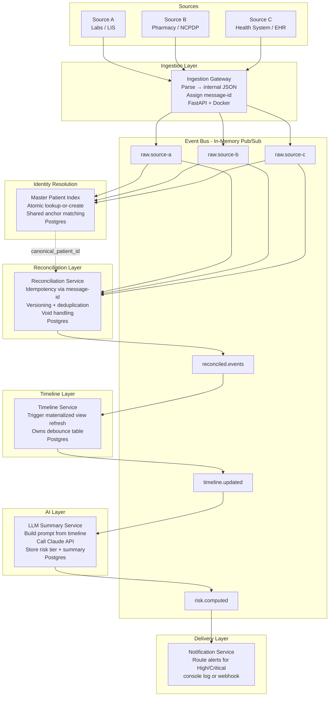

# MVP Architecture Plan — Healthcare Data Processing Platform

## Summary

This plan describes the architecture for a learning project modeled after Pearl Health's value-based care platform. The system ingests patient records from multiple independent sources, reconciles delayed and corrected records, constructs a longitudinal patient timeline, applies LLM-based risk assessment, and delivers alerts.

This is a hypothesis/learning project. No real patient data is used.

## Key Decisions

- Event-driven architecture using **NATS** as the message broker — see Section 1 for full rationale.
- Each service connects to NATS via the `nats-py` async client. The NATS connection is established in the FastAPI lifespan and stored on `app.state.nc` for use across the service.
- The bus interface (`publish` / `subscribe`) is kept intentionally narrow so the backing implementation can be swapped to NATS JetStream or Kafka without touching service logic.
- Internal data is stored as plain JSON in Postgres. No external data standards imposed.
- Idempotency is enforced via a stable `message-id` header on every inbound event — see Section 2.
- Reconciliation Service resolves `canonical_patient_id` from MPI via HTTP call between containers — see Section 2.
- Reconciliation is a first-class concern — handled by a dedicated service, not bolted onto ingestion.
- **Risk stratification is LLM-driven** — the LLM receives a patient summary and returns a structured risk assessment.
- LLM is inserted post-reconciliation so it always operates on the cleanest available timeline.
- **No UI in scope.** Backend services only.
- Service framework: **FastAPI (Python)**. Container runtime: **Docker Compose** — one container per service.
- Python package management: **uv** with **pyproject.toml**. Monorepo workspace layout — one `pyproject.toml` per service plus a shared internal library. Each service is independently deployable.

## Assumptions

- This is a learning project — service boundaries are illustrative rather than production-grade.
- A single Postgres instance with per-service schemas is acceptable.
- LLM backend is abstracted via `CacheService` and `LLMBackend` interfaces backed by dictionaries for the demo. Both can be swapped independently without changing service logic.
- Synthetic/mock data only — no real patient data.
- Three inbound data sources are modeled: **Source A (Labs / LIS)**, **Source B (Pharmacy / NCPDP)**, and **Source C (Health System / EHR)**. Each operates independently, on its own schedule, and uses its own patient identifiers.

## Risks and Dependencies

- Reconciliation logic is domain-specific and requires clear business rules before implementation.
- LLM-based risk assessment quality depends on prompt design — prompt templates must be versioned.
- The MPI matching logic must be atomic to avoid race conditions when all three sources arrive in parallel.

---

## 1. Why a Message Bus

### Rationale

Source A (Labs), Source B (Pharmacy), and Source C (Health System) do not deliver data at the same time or at the same rate. Source A (Labs) may fire an event immediately when a result is ready. Source B (Pharmacy) may deliver dispensing records days or weeks later. Source C (Health System) pushes data on a scheduled EHR export. Each source operates independently.

A message bus decouples these producers from the services that need to react to them. Without a bus, every downstream service would need to be called directly by the ingestion layer — creating tight coupling that breaks when any service is slow, redeploying, or processing a correction.

**Chosen implementation: NATS** — a lightweight open-source message broker. Single Docker container,
no configuration file needed for basic pub/sub. Each service connects as an async client using
`nats-py`.

**Why NATS over Kafka for this POC:**
- Single container, no ZooKeeper or schema registry required
- Native async Python client (`nats-py`) matches the FastAPI async model exactly
- Simple enough that the compose file stays readable
- Already the listed production step-up path — same concepts apply at scale

**Connection pattern — FastAPI lifespan:**

Every service that publishes or subscribes follows this pattern. The NATS connection is opened on
startup, stored on `app.state` for access in handlers, and drained cleanly on shutdown:

```python
from contextlib import asynccontextmanager
import nats

@asynccontextmanager
async def lifespan(app: FastAPI):
    nc = await nats.connect("nats://nats:4222")
    await nc.subscribe("reconciled.events", cb=handle_reconciled_event)
    app.state.nc = nc
    yield
    await nc.drain()  # flush in-flight messages before shutdown

app = FastAPI(lifespan=lifespan)
```

`app.state` is a FastAPI/Starlette built-in namespace for storing application-lifetime objects
(connections, pools, config). It avoids module-level globals and is accessible anywhere via
`request.app.state.nc`.

**Publish:**
```python
await app.state.nc.publish(
    "reconciled.events",
    json.dumps(event).encode()
)
```

**Subscribe:**
```python
async def handle_reconciled_event(msg):
    event = json.loads(msg.data.decode())
    # process event...
```

**Trade-offs accepted for POC:**
- No message persistence — NATS core (non-JetStream) does not store messages. If a service is
  down when a message is published, the message is lost. The source of truth is Postgres — missed
  messages can be recovered by re-reading from the DB.
- No consumer groups / competing consumers — NATS core delivers to all subscribers. Horizontal
  scaling requires NATS JetStream (queue groups), deferred to production.

### What Flows as Messages

| Topic | What the message represents | Producer | Why consumed |
|---|---|---|---|
| `raw.source-a` | An event from Source A (Labs / LIS) | Ingestion Gateway | MPI registers the patient; Reconciliation records the event |
| `raw.source-b` | An event from Source B (Pharmacy / NCPDP) | Ingestion Gateway | MPI registers the patient; Reconciliation versions the record |
| `raw.source-c` | An event from Source C (Health System / EHR) | Ingestion Gateway | MPI registers the patient; Reconciliation merges the record |
| `reconciled.events` | A validated, deduplicated, versioned patient event | Reconciliation Service | Timeline Service updates the patient timeline and upserts debounce record |
| `timeline.updated` | A patient's timeline has settled (emitted after debounce window) | Timeline Service | LLM Summary Service runs assessment for this patient |
| `risk.computed` | A completed LLM risk assessment | LLM Summary Service | Notification Service routes alerts |

### Internal Data Format

Each source's raw format is parsed at the Ingestion Gateway boundary and converted to simple internal JSON structs. Each service defines its own minimal schema. No shared canonical data model is imposed across services.

### Pipeline Style

**Kappa-style**: everything is a stream. Derived views (timeline, risk) are materialized from stream events. No separate batch ETL step.

---

## 2. Reconciliation and Idempotency

Records from all three sources are routinely:
- **Delayed** — Source B records may arrive long after the originating event.
- **Corrected** — sources may re-send updated versions of previously delivered records.
- **Duplicated** — the same real-world event may arrive from more than one source.

### Idempotency via Header IDs

Every message published to the broker carries a stable `message-id` header. This is the primary idempotency mechanism across all services.

**How it works:**
1. The Ingestion Gateway assigns a `message-id` derived deterministically from the source record's own identifier: `sha256(source_id + version + source_system)`.
2. Before processing, each service checks whether `message-id` already exists in its local idempotency table.
3. If found: skip processing, acknowledge the message, return the previously stored result.
4. If new: process, store the result, record the `message-id`.

Any service can safely re-consume a topic from the beginning without producing duplicate records.

**Idempotency table (per service, in Postgres):**
```sql
CREATE TABLE processed_messages (
  message_id   TEXT PRIMARY KEY,
  processed_at TIMESTAMPTZ NOT NULL DEFAULT NOW(),
  result_ref   TEXT  -- optional pointer to the resulting record
);
```

### MPI Lookup — POC vs Production

**POC:** Reconciliation calls MPI via HTTP (`GET /internal/patient/resolve`) between containers.
MPI exposes an internal endpoint that performs the lookup-or-create and returns `canonical_patient_id`.
Reconciliation retries with exponential backoff to handle the narrow race where Reconciliation
receives a raw event before MPI has completed its upsert:

```
attempt 1 → immediate
attempt 2 → wait 100ms
attempt 3 → wait 200ms
attempt 4 → wait 400ms
attempt 5 → wait 800ms → dead-letter on failure
```

**Production path:** MPI publishes an `identity.resolved` event to NATS after its upsert.
Reconciliation subscribes to `identity.resolved` instead of polling over HTTP — eliminates the
race class entirely and removes the synchronous HTTP dependency.

### Additional Reconciliation Patterns

- **Versioned records** — corrected records are stored as a new version; queries always surface the latest non-voided version.
- **Tombstone events** — a cancellation is an explicit event that marks prior records inactive, not a deletion.
- **Late-arrival windows** — events arriving within N days of the event date are reconciled into the active window; older late arrivals trigger a reprocessing path.

---

## 3. Master Patient Index (MPI)

The MPI answers one question: *"Is the patient in this incoming event the same person I have already seen from a different source?"*

### The Problem

Source A, Source B, and Source C each assign their own internal patient identifiers. The same real-world patient will have three different IDs across three sources. Without resolution, downstream services would build three separate timelines for the same person.

### Who Goes First — The Race Condition

All three sources may publish events in parallel. Whichever source event reaches the MPI first **creates** the canonical patient ID. All later arrivals for the same patient **match** to it. Order does not matter for correctness — what matters is that the lookup-or-create operation is **atomic**.

If two events arrive simultaneously and both find no existing record, they could each try to create a new canonical ID — producing two records for the same person. This is prevented with a single atomic database upsert:

```sql
-- Attempt to insert; on conflict (shared anchor already exists), do nothing
INSERT INTO mpi_patients (shared_identifier, canonical_patient_id)
VALUES ($shared_id, gen_random_uuid())
ON CONFLICT (shared_identifier) DO NOTHING;

-- Always fetch — returns existing record if conflict occurred
SELECT canonical_patient_id FROM mpi_patients WHERE shared_identifier = $shared_id;
```

### The Shared Anchor

Matching requires at least one **shared data element** that all sources include — something stable that identifies the same real-world patient across systems. Without a shared field, three parallel arrivals look like three different people.

For this system, the shared anchor is a patient registration ID agreed upon across all sources (equivalent to a Medicare Beneficiary ID in the real world). Name + date of birth serves as a fallback when the shared ID is absent.

### MPI Data Model (Postgres)

```sql
-- One row per unique patient
CREATE TABLE mpi_patients (
  canonical_patient_id  UUID PRIMARY KEY DEFAULT gen_random_uuid(),
  shared_identifier     TEXT UNIQUE,  -- the cross-source identifier used for matching (MBI)
  created_at            TIMESTAMPTZ NOT NULL DEFAULT NOW()
);

-- One row per (source, source_patient_id) pair seen
CREATE TABLE mpi_source_identities (
  id                    BIGSERIAL PRIMARY KEY,
  canonical_patient_id  UUID NOT NULL REFERENCES mpi_patients(canonical_patient_id),
  source_system_id      INT NOT NULL REFERENCES mpi_source_system(source_system_id),
  source_patient_id     TEXT NOT NULL,  -- the ID that source assigned to this patient
  first_name            TEXT,
  last_name             TEXT,
  date_of_birth         DATE,
  created_at            TIMESTAMPTZ NOT NULL DEFAULT NOW(),

  UNIQUE (source_system_id, source_patient_id)  -- one canonical ID per source record, enforced
);

CREATE INDEX idx_mpi_source    ON mpi_source_identities(source_system_id, source_patient_id);
CREATE INDEX idx_mpi_name_dob  ON mpi_source_identities(last_name, date_of_birth);
CREATE INDEX idx_mpi_canonical ON mpi_source_identities(canonical_patient_id);
```

All downstream services (Reconciliation, Timeline, LLM) use only `canonical_patient_id`. Source-specific IDs are retained for provenance but never used for routing.

---

## 4. Patient Timeline Construction

A patient timeline is a longitudinal, deduplicated, chronologically ordered sequence of events anchored to a single canonical patient ID.

### Construction Steps

1. Reconciliation Service resolves `canonical_patient_id` via MPI before processing any event.
2. Deduplication — if two sources report the same real-world event, select the authoritative source and discard the duplicate.
3. Apply versioning — replace corrected versions, suppress voided events.
4. Reconciliation Service writes the event to `reconciliation_events` and publishes to `reconciled.events`.
5. Timeline Service receives `reconciled.events` and calls `REFRESH MATERIALIZED VIEW CONCURRENTLY patient_timeline`. Postgres recomputes the view from `reconciliation_events WHERE status = 'active'`, ordered by `event_date` per patient. The Timeline Service does not write rows — it only triggers the refresh.
6. Timeline Service upserts `llm_pending_assessments` for the patient, bumping `scheduled_after` to reset the debounce window. Timeline Service owns the debounce table.
7. After the debounce window expires with no further events for that patient, Timeline Service emits `timeline.updated` — only after the refresh completes (refresh-then-publish).
8. LLM Summary Service subscribes to `timeline.updated` and reads from `patient_timeline` for that patient.

### Refresh-Then-Publish Ordering Rule

The Timeline Service must **call `REFRESH MATERIALIZED VIEW CONCURRENTLY` before publishing `timeline.updated`**. If the order is reversed and the service crashes between publish and refresh, the LLM Summary Service is triggered but reads stale data.

If Timeline Service crashes after refreshing but before publishing, `timeline.updated` is simply not emitted. The materialized view in Postgres retains the last successfully refreshed state. The LLM Summary Service reads stale but correct data until the next `timeline.updated` is published. The cron safety net will catch this.

**Note:** `REFRESH MATERIALIZED VIEW CONCURRENTLY` requires a unique index on the view and refreshes the entire view, not per-patient. For the POC with synthetic data this is acceptable. Per-patient incremental refresh (via `pg_ivm`) is a future optimisation.

### Key Design Properties

- The timeline is a **Postgres materialized view** over `reconciliation_events`. The Timeline Service triggers refresh; Postgres owns the materialization logic.
- The event log in `reconciliation_events` is the source of truth. The materialized view is always reproducible by calling `REFRESH`.
- `REFRESH MATERIALIZED VIEW CONCURRENTLY` is non-blocking — reads continue against the prior snapshot while the refresh runs.
- Each event in the view carries provenance: source system, ingested-at timestamp, version number.

---

## 5. Risk Stratification — LLM-Driven

Risk is assessed after the timeline is materialized. There is no separate rule-based engine.

### LLM Risk Assessment Pattern

The LLM Summary Service builds a prompt from:
1. The patient's recent timeline events (configurable window, e.g. last 90–365 days).
2. Patient demographics (age, known conditions from timeline).
3. A versioned task instruction: *"Based on this patient's history, assign a risk tier (Low / Medium / High / Critical), list the top 3 risk factors, and recommend 2–3 care actions."*

The response is stored as structured JSON:

```json
{
  "risk_tier": "High",
  "key_risks": ["multiple recent events", "no follow-up recorded", "escalating pattern"],
  "recommended_actions": ["schedule follow-up within 7 days", "review current care plan"],
  "summary": "Patient presents elevated risk based on recent event pattern...",
  "generated_at": "2026-03-22T18:00:00Z",
  "model": "claude-sonnet-4-6",
  "prompt_version": "v1"
}
```

### Guardrails

- Output stored with prompt version and model version for auditability.
- Always labeled AI-generated — not a clinical decision.
- Only synthetic data sent to the LLM provider.

---

## 6. LLM Integration

The LLM Summary Service performs both risk stratification and plain-language summary generation.
It is designed as an **agent loop** — capable of multi-step reasoning, tool use, and RAG-style
retrieval to confirm and enhance recommendations. For the demo, the LLM backend is abstracted
behind an adapter interface so it can be swapped without changing service logic.

### Adapter Interface

The service calls a single abstract backend interface:

```
LLMBackend.complete(prompt: str, context: dict) -> AsyncIterator[str]
```

**Demo implementation:** returns responses from a static dictionary keyed by risk scenario.
Responses are emitted asynchronously with a simulated delay to model agent processing time.

**Future entry points (not in scope for MVP):**
- Ollama (local model, same interface)
- LangGraph (stateful agent loop with tool use and RAG)
- Anthropic Claude API (direct)

### Inference Modes

There are exactly two points at which `llm_recommendations` is written:

| Mode | Trigger | Cost driver |
|---|---|---|
| **Nightly batch** | Scheduler drains `llm_pending_assessments` at end of day | Lowest — bulk throughput, prompt caching applies |
| **Agent session** | User explicitly interacts with LLM agent and a new recommendation is produced | Highest — streaming, session-scoped |

**UI load is a read operation, not an inference trigger.** When a user opens a patient record,
the system reads from cache first, falling back to `llm_recommendations` in Postgres on a cache
miss. No LLM call is made. The displayed recommendation is always the last written result —
either from the nightly batch or the most recent agent session.

```
UI loads patient record
  → cache hit  →  return cached recommendation  (no LLM call)
  → cache miss →  read llm_recommendations (latest row by generated_at DESC)  (no LLM call)
               →  populate cache for next read

User chats with agent, agent produces new recommendation
  → LLM inference runs
  → write to llm_recommendations (mode = 'agent')
  → update cache
```

### Debounce Pattern

The LLM does not process on every `reconciled.events` emission. Reconciliation events for the
same patient can arrive in rapid succession (e.g. a Source C batch export). Running the LLM on
each would be wasteful — only the final settled state matters.

**The Timeline Service owns the debounce.** On each `reconciled.events` message it upserts
`llm_pending_assessments`, bumping `scheduled_after` forward to reset the window. Once the
debounce window expires with no further events for that patient, the Timeline Service emits
`timeline.updated` on the bus. The LLM Summary Service subscribes to `timeline.updated` — this
is the direct trigger for LLM inference.

The cron scheduler (every 12 hours) is a **safety net** — it drains any `llm_pending_assessments`
rows that are settled but whose `timeline.updated` was not emitted (e.g. Timeline Service
restarted mid-debounce). It is not the primary trigger.

```
reconciled.events (patient X)  →  Timeline upserts llm_pending_assessments, bumps scheduled_after
reconciled.events (patient X)  →  Timeline upserts llm_pending_assessments, bumps scheduled_after (resets)

[debounce window expires — no further events]

Timeline Service  →  emits timeline.updated (patient X)
LLM Summary Service  →  receives timeline.updated  →  runs assessment

[cron every 12h — safety net only]
cron  →  finds any settled pending rows not yet processed  →  triggers assessment for those patients
```

Only the last valid emission is processed. Intermediate states are discarded.

**Known scaling consideration:** a Source C nightly export of N patients produces N upserts
followed by N LLM assessments draining simultaneously after the debounce window. The database
upsert pressure is low (single-row primary key updates). The bottleneck is the LLM worker
throughput — the batch worker must be sized to drain the queue within the nightly window.

### Prompt Caching

For nightly batch, the prompt prefix — patient demographics and static context — is identical
across runs for the same patient and eligible for caching. Only delta events since the last
assessment need to be sent uncached. For a population where most patients have minimal daily
change, cache hit rate is expected to be high, significantly reducing batch inference cost.
Prompt version must be included in the cache key — a prompt template change invalidates all
cached prefixes.

### Processing Model

All LLM processing is **async**. The worker does not block — it yields partial results as they
arrive and assembles the final structured output on completion. This models the latency profile
of a real agent loop where multiple reasoning steps may occur before a final answer is produced.

**Return contract by caller:**

| Caller | Returns | Why |
|---|---|---|
| Agent session (UI-initiated) | Full recommendation result | A user is waiting for the response |
| Nightly batch | `None` — internal status only | No caller is waiting; batch marks the pending row `done` and moves on |

Batch is fire-and-forget. The only acknowledgment is the internal state transition on
`llm_pending_assessments`: `processing` → `done`. Nothing is returned upstream.

### Service Steps (Batch Mode)

Batch runs on a **cron schedule every 12 hours**.

1. Cron triggers LLM worker (owned by the LLM Summary Service process).
2. Worker queries `llm_pending_assessments` for all patients where `scheduled_after < NOW() AND status = 'pending'`.
3. Marks each row `processing` to prevent double-processing.
4. For each patient — fetches materialized timeline from Postgres.
5. Constructs versioned prompt; applies prompt caching on static prefix.
6. Calls `LLMBackend.complete()` asynchronously — demo backend returns from dictionary.
7. **Inference timeout:** if `LLMBackend.complete()` exceeds the configured timeout, the assessment errors out. The pending row is marked `failed` and a retry message is enqueued to the dead-letter queue (DLQ). The DLQ reprocessing service is **not implemented in this POC** — failed rows are noted for future implementation.
8. On success — parses and validates structured JSON response.
9. Writes result to `llm_recommendations` with `mode = 'batch'`.
10. Marks pending row `done` and publishes `risk.computed` for the Notification Service.
11. Returns `None` — no caller is waiting.

**Agent session:** inference is handled directly via `LLMBackend` within the session; result
written to `llm_recommendations` with `mode = 'agent'` and cache updated. The pending row in
`llm_pending_assessments` is unaffected — the next batch run will still append its own row if
data has changed. History is preserved; the UI always surfaces the latest by `generated_at DESC`.

The LLM is never in the ingestion or reconciliation path — it only reads finalized, deduplicated
data from the materialized timeline.

### Output — Recommendations Table and Cache

Results are written to `llm_recommendations` in Postgres and the cache is updated in the same
operation. Each row is immutable once written; a new assessment appends a new row preserving
full history.

**Read path (UI fetch):**
1. Cache lookup by `canonical_patient_id` — return immediately on hit.
2. Cache miss — read latest row from `llm_recommendations` by `generated_at DESC`, populate cache.

**Write path (inference only):**
1. Compute SHA-256 hash of the new recommendation output.
2. Fetch the last recommendation for this patient from cache or DB.
3. **Hash match** — hashes are identical → `has_changed_from_last = false`, `similarity_score = null`. Skip write entirely. No DB connection consumed.
4. **Hash differs** → run structural diff on `risk_tier` and `key_risks`.
   - Structural diff shows change → `has_changed_from_last = true`, `similarity_score = null`. Write immediately — no cosine needed.
   - Structural diff shows no change (`has_changed_from_last = false`) → borderline case. Compute cosine similarity on `summary` embedding as tiebreaker. Set `similarity_score` to result. If above threshold → skip write. If below threshold → `has_changed_from_last = true`, write.
5. If write proceeds — append row to `llm_recommendations`, update cache, publish `risk.computed`.
6. If write skipped — no DB write, no cache update, `risk.computed` not published.

**Cosine similarity is only computed in the borderline case** — when the hash has changed but the structural diff finds no material difference. It is never computed when the hash matches (identical) or when the structural diff already confirms a clear change.

### Recommendation Deduplication — Similarity Methods

| Method | Compares | Cost | Catches |
|---|---|---|---|
| SHA-256 hash | Full output, exact | Free | Identical outputs — most batch duplicates |
| Structural diff | `risk_tier` + `key_risks` set intersection | Free | Same conclusion, minor wording drift |
| Jaccard similarity | Token overlap on `key_risks` arrays | Trivial | Partial set overlap |
| Cosine similarity (pgvector) | Embedding of `summary` free-text | Medium — requires embed call | Semantic equivalence, paraphrasing |
| LLM self-evaluation | Asks LLM if outputs differ | Expensive | Not recommended — defeats deduplication purpose |

**Default for MVP demo:** hash check only. Structural diff and cosine similarity are extension
points for later phases.

The `mode` column (`'batch'` or `'agent'`) and `has_changed_from_last` flag distinguish the
source and significance of each recommendation row.

---

## 7. Microservices Topology

### Services

| Service | Responsibility |
|---|---|
| Ingestion Gateway | Accepts raw events from Source A, B, C. Parses to internal JSON. Assigns `message-id`. Publishes to raw topics. **FastAPI + Docker.** |
| Master Patient Index (MPI) | Resolves patient identity across sources atomically. Assigns and stores canonical patient IDs. Postgres-backed. |
| Reconciliation Service | Consumes raw topics. Enforces idempotency via `message-id`. Applies versioning, deduplication, late-arrival, and void handling. Publishes `reconciled.events`. Scales horizontally via consistent hashing on `canonical_patient_id` — all events for the same patient route to the same instance. Each instance owns its own shard of `reconciliation_events`, `reconciliation_processed_messages`, and `reconciliation_conflicts`, partitioned by `canonical_patient_id` hash. Instances do not share tables — no cross-instance contention. Hot shard mitigation deferred. |
| Timeline Service | Consumes `reconciled.events`. Calls `REFRESH MATERIALIZED VIEW CONCURRENTLY patient_timeline` — Postgres recomputes the view from `reconciliation_events`. Timeline Service does not write rows. Owns `llm_pending_assessments` debounce table. Publishes `timeline.updated` after refresh completes (refresh-then-publish). |
| LLM Summary Service | Debounced — Timeline Service writes to `llm_pending_assessments` on each `reconciled.events`; LLM worker polls for settled patients (no new events within window). Fetches materialized timeline, calls abstract `LLMBackend` async (demo: dictionary; future: Ollama, LangGraph, Claude API). Writes result to `llm_recommendations`. Publishes `risk.computed`. |
| Notification Service | Consumes `risk.computed`. Routes alerts for High/Critical risk patients (console log only in POC). Outbound webhook delivery (`WEBHOOK_URL`) is not implemented — placeholder for a future phase. |
| Patient API Service | Exposes HTTP endpoints for external consumers. Calls downstream services to read from their own schemas. Does not own any DB tables. See Section 10 for endpoint definitions. |

### Event Bus Topics

| Topic | Producer | Consumer(s) | Why |
|---|---|---|---|
| `raw.source-a` | Ingestion Gateway | MPI, Reconciliation Service | Register patient; record Source A event |
| `raw.source-b` | Ingestion Gateway | MPI, Reconciliation Service | Register patient; version Source B record |
| `raw.source-c` | Ingestion Gateway | MPI, Reconciliation Service | Register patient; merge Source C record |
| `reconciled.events` | Reconciliation Service | Timeline Service | Trigger timeline rebuild for the affected patient |
| `timeline.updated` | Timeline Service | LLM Summary Service | Trigger risk assessment and summary regeneration |
| `risk.computed` | LLM Summary Service | Notification Service | Route alerts based on risk tier |

---

## 8. Full Data Flow Diagram



---

## 9. Implementation Plan

### Phase 1: Foundation

1. Implement the `MessageBus` module (`/shared/message_bus.py`). Stable `publish` / `subscribe` / `unsubscribe` interface backed by in-memory async queues. This is the only component that changes when swapping to a real broker.
2. Implement the `CacheService` module (`/shared/cache_service.py`). Abstract interface backed by a plain Python dictionary for the demo. Swap the backing implementation for Redis without changing any service code.
3. Define internal JSON schemas for each event type (source event, reconciled event, timeline record, risk assessment). Store in `/schemas`.
4. Implement the Ingestion Gateway (FastAPI). Three adapters for Source A, B, C. Each assigns a deterministic `message-id` and publishes to the appropriate raw topic.
5. Implement the MPI service. Atomic lookup-or-create on shared anchor. Fallback to name + DOB. Postgres-backed.

### Phase 2: Reconciliation and Timeline

6. Implement the Reconciliation Service. Consume raw topics. Check `message-id` idempotency table. Handle versioned and voided records. Post conflicts to `reconciliation_conflicts` table (downstream workflow not implemented in POC). Publish to `reconciled.events`. Note: late-arrival reprocessing (R5) is out of scope for this POC.
7. Implement the Timeline Service. Consume `reconciled.events`. Call `REFRESH MATERIALIZED VIEW CONCURRENTLY patient_timeline` (Postgres owns the materialization query). Own and upsert `llm_pending_assessments` debounce table. Emit `timeline.updated` after refresh completes and debounce window settles.

### Phase 3: LLM Risk and Summary

8. Implement the LLM Summary Service. Subscribe to `timeline.updated`. Fetch materialized timeline. Build versioned prompt. Call `LLMBackend` interface asynchronously — implement demo backend using a static dictionary with simulated async delay. Apply deduplication (hash check first). Write result to `llm_recommendations` and update `CacheService`. Publish `risk.computed`. Implement cron scheduler (every 12 hours) with inference timeout and DLQ enqueue on failure (DLQ consumer not implemented in POC).

### Phase 4: Notification, API, and Observability

8. Implement the Notification Service. Consume `risk.computed`. Log or webhook alerts for High/Critical patients.
9. Implement the Patient API Service. FastAPI service exposing the six endpoints defined in Section 10. Downstream calls are direct in-process function calls for the POC.
10. Add structured logging with `correlation-id` (derived from `message-id`) across all services for end-to-end traceability.
11. Write synthetic data generators for Source A, B, and C. Include scenarios with delayed records, corrections, and duplicate events.

---

## 10. Patient API Service

The Patient API Service is a FastAPI service that exposes read and write endpoints for external
consumers (UI, CLI, testing). It does not own any database tables — it calls downstream services
which read from their own schemas. In the POC, downstream calls are direct in-process function
calls. In production each downstream service exposes its own internal HTTP API.

### Endpoints

#### GET /v1/patient/{canonical_patient_id}/info

Returns patient identity record from the MPI.

- **Source:** MPI Service → `mpi_patients` + `mpi_source_identities`
- **Response:** `canonical_patient_id`, `shared_identifier`, `created_at`, list of source identities
  (source system name, source patient ID, name, DOB)

---

#### GET /v1/patient/{canonical_patient_id}/timelines

Returns the patient's chronological event timeline, paginated.

- **Source:** Timeline Service → `patient_timeline` materialized view
- **Query params:** `page` (default 1), `pageSize` (default 10)
- **Pagination note:** `patient_timeline` stores all events as a single JSON array per patient row.
  Pagination is applied in application code by slicing the array after fetch — not at the DB level.
  Latest events are returned first (array reversed before slicing).
- **Response:** `canonical_patient_id`, `total_events`, `page`, `pageSize`, `events[]`

---

#### GET /v1/patient/{canonical_patient_id}/recommendation

Returns the most recent recommendation for the patient.

- **Source:** LLM Summary Service → `CacheService` first, fallback to `llm_recommendations ORDER BY generated_at DESC LIMIT 1`
- **Response:** full recommendation record — `risk_tier`, `key_risks`, `recommended_actions`,
  `summary`, `model`, `prompt_version`, `mode`, `has_changed_from_last`, `generated_at`

---

#### GET /v1/patient/{canonical_patient_id}/recommendations

Returns paginated recommendation history for the patient.

- **Source:** LLM Summary Service → `llm_recommendations ORDER BY generated_at DESC`
- **Query params:** `page` (default 1), `pageSize` (default 10)
- **Response:** `canonical_patient_id`, `total`, `page`, `pageSize`, `recommendations[]`

---

#### GET /v1/patient/{canonical_patient_id}/conflicts

Returns paginated reconciliation conflicts for the patient.

- **Source:** Reconciliation Service → `reconciliation_conflicts ORDER BY created_at DESC`
- **Query params:** `page` (default 1), `pageSize` (default 10)
- **Response:** `canonical_patient_id`, `total`, `page`, `pageSize`, `conflicts[]`

---

#### POST /v1/patient/recommendations

Triggers an agent session inference for a patient, producing a new recommendation immediately
rather than waiting for the next nightly batch.

- **Request body:**
  ```json
  {
    "opType": "refresh",
    "patientId": "<canonical_patient_id>"
  }
  ```
- **Behaviour:** Patient API calls LLM Summary Service directly. LLM Summary Service runs
  inference in agent session mode (`mode = 'agent'`), writes result to `llm_recommendations`,
  updates cache, and publishes `risk.computed` if the recommendation has changed.
- **Response:** the newly written recommendation record, or the existing record unchanged if
  the hash check determined no material change.
- **Note:** this is the only HTTP-triggered write path into `llm_recommendations`. All other
  writes are event-driven (nightly batch via `timeline.updated`).

---

### Call Map

| Endpoint | Downstream service | Table read |
|---|---|---|
| `GET /info` | MPI | `mpi_patients`, `mpi_source_identities` |
| `GET /timelines` | Timeline | `patient_timeline` (mat view) |
| `GET /recommendation` | LLM Summary | Cache → `llm_recommendations` |
| `GET /recommendations` | LLM Summary | `llm_recommendations` |
| `GET /conflicts` | Reconciliation | `reconciliation_conflicts` |
| `POST /recommendations` | LLM Summary | Triggers inference → writes `llm_recommendations` |

---

## Appendix: Python Dependencies

### Core Libraries (per service)

| Package | Version constraint | Purpose |
|---|---|---|
| `fastapi` | `>=0.111` | HTTP framework and dependency injection |
| `uvicorn[standard]` | `>=0.29` | ASGI server; `[standard]` pulls in `watchfiles` and `httptools` |
| `nats-py` | `>=2.7` | Async NATS client — publish / subscribe / drain |
| `asyncpg` | `>=0.29` | Async Postgres driver; used directly for raw SQL and idempotency table upserts |
| `pydantic` | `>=2.6` | Request/response validation; ships with FastAPI but pinned explicitly |

### Package Management

| Tool | Role |
|---|---|
| `uv` | Fast resolver and virtual-env manager; replaces `pip` + `pip-tools`. Each service has its own `pyproject.toml`; the repo root holds the workspace definition. |
| `pyproject.toml` | Declares `[project]` metadata and `[project.dependencies]` per service. Dev extras (`[project.optional-dependencies] dev = [...]`) hold test and lint tools. |

### `pyproject.toml` (single file at repo root)

One `pyproject.toml` at the monorepo root covers all services. Services are not independently packaged — they share a single dependency set.

```toml
[project]
name = "learning-healthcare-processing"
version = "0.1.0"
requires-python = ">=3.12"
dependencies = [
    "fastapi>=0.111",
    "uvicorn[standard]>=0.29",
    "nats-py>=2.7",
    "asyncpg>=0.29",
    "pydantic>=2.6",
]

[project.optional-dependencies]
dev = ["pytest", "pytest-asyncio", "httpx", "ruff"]
```

### No ORM — asyncpg directly

An ORM (e.g. SQLAlchemy, SQLModel) was considered and skipped. Reasons:

- All SQL in this project is simple and already written explicitly — idempotency upserts, atomic `ON CONFLICT DO NOTHING`, `REFRESH MATERIALIZED VIEW CONCURRENTLY`. An ORM does not simplify these.
- `REFRESH MATERIALIZED VIEW CONCURRENTLY` is a raw DDL statement; ORMs execute it as a literal string anyway.
- `asyncpg` is async-native and maps directly onto the FastAPI/NATS async model with no session lifecycle overhead.
- Fewer abstraction layers — easier to reason about what SQL is actually running.

If the project grows to include many related models or requires schema migrations, adding SQLAlchemy Core (not the ORM layer) or Alembic would be the natural next step.

### Service Startup

Every service is launched with uvicorn from a `Dockerfile` or `docker-compose.yml`:

```
uvicorn app.main:app --host 0.0.0.0 --port 8000
```

The FastAPI `lifespan` context manager handles NATS connection and asyncpg pool setup/teardown on startup and shutdown (see Section 1 for the lifespan pattern).

---

## Appendix: Technology Reference

| Concern | MVP choice | Production equivalent |
|---|---|---|
| Event bus | NATS (core, no persistence) | NATS JetStream → Apache Kafka |
| Message broker — AWS equivalent | *(swap NATS for Kinesis in compose)* | Amazon Kinesis |
| Cache | `CacheService` interface backed by a plain Python dictionary | Redis (swap the backing implementation, interface unchanged) |
| All datastores | Postgres (single instance, per-service schemas) | Postgres or columnar store |
| LLM backend | Abstract `LLMBackend` interface; demo uses static dictionary with async simulation | Ollama (local), LangGraph (agent loop), or Anthropic Claude API |
| Batch scheduler | Cron job inside LLM Summary Service, runs every 12 hours | AWS EventBridge, Airflow, or Celery Beat |
| DLQ (failed inference) | Noted only — not implemented in POC | AWS SQS DLQ or NATS JetStream with retry policy |
| Late-arrival reprocessing (R5) | Noted only — not implemented in POC | Dedicated reprocessing worker reading from event log |
| Service framework | FastAPI (Python) | Same |
| Package management | uv + pyproject.toml (workspace per service) | Same |
| Container runtime | Docker Compose | Kubernetes |
| UI | Out of scope for MVP | React or Next.js |
